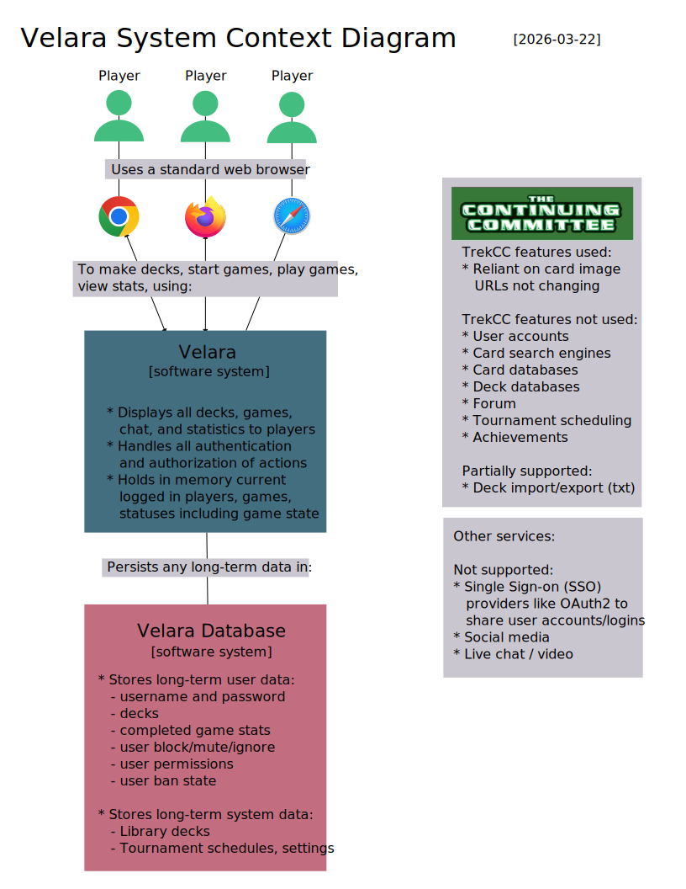
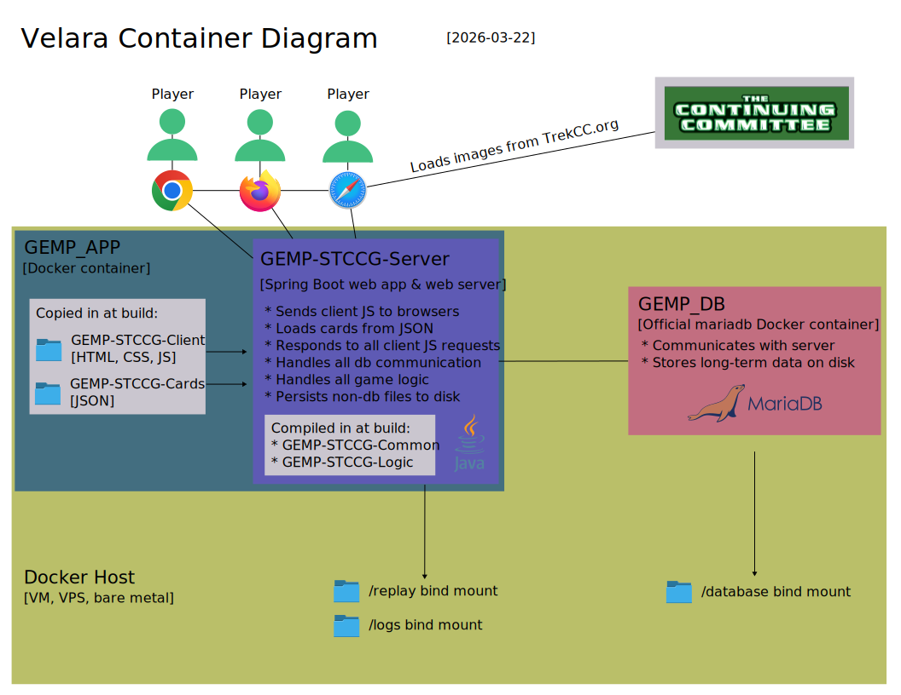
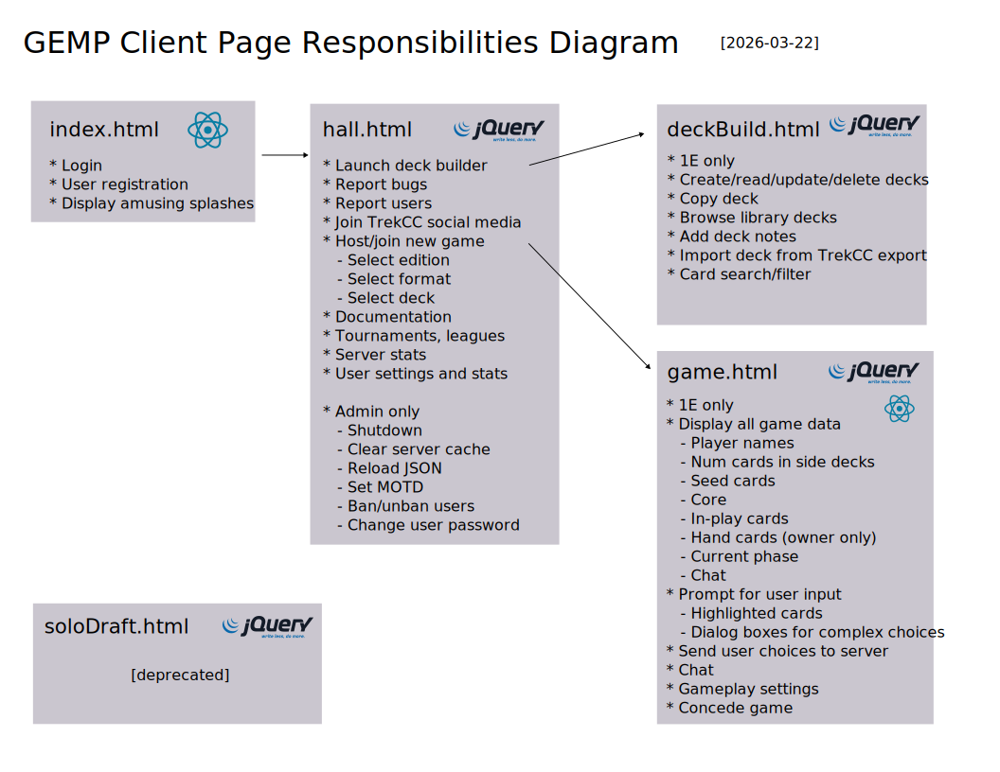
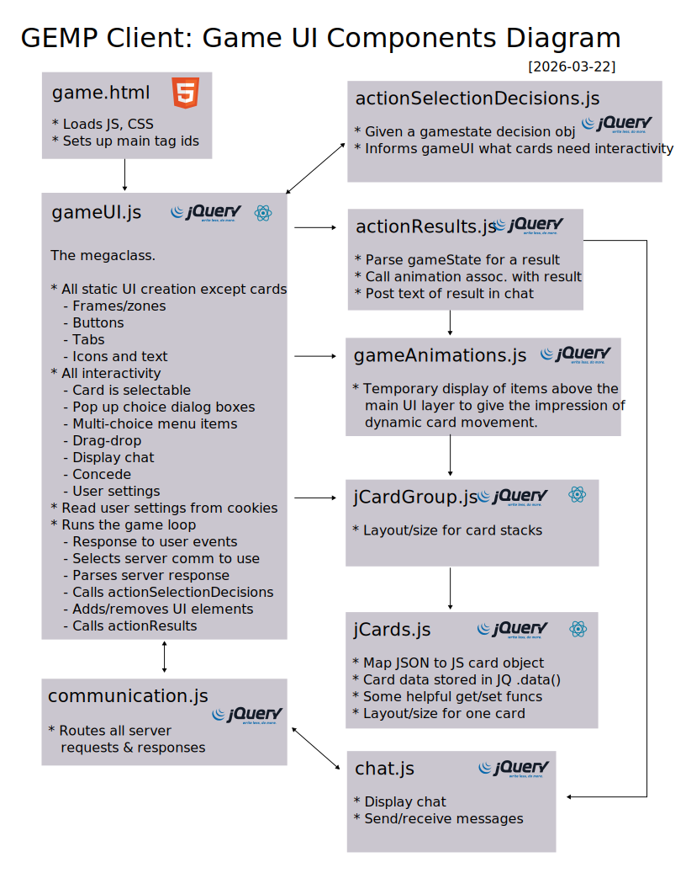

# Architecture
Documented using the [C4 Model](https://c4model.com/)

## Context
Who uses GEMP? Why? How does it relate to other services the user might be familiar with?

## Container
What are the major pieces of a hosted GEMP application? What do those pieces do?

## Component

### GEMP Client

## Code
### Action Results
The serialized game state property "actionResults" contains information about game actions that have been initiated and/or completed. On the server side, these objects belong to the class ActionResult.
[actionResults](actionResults.md)

### GameState JSON example
GameState JSON represents a snapshot of a given point in time during the middle of a game. It contains all player, card, card relationship, pending/allowed actions, and historical data required to draw the UI.

[Gamestate example](gamestate-example.hjson)

### Game Hall JSON example
The Game Hall JSON lists all active games, tournaments, and other data required to draw the hall UI.

[Game hall example](serialized-hall-example.hjson)

### Example Games
[sampleGameLoader](sampleGameLoader.md)
[actionTestGame](actionTestGame.md)