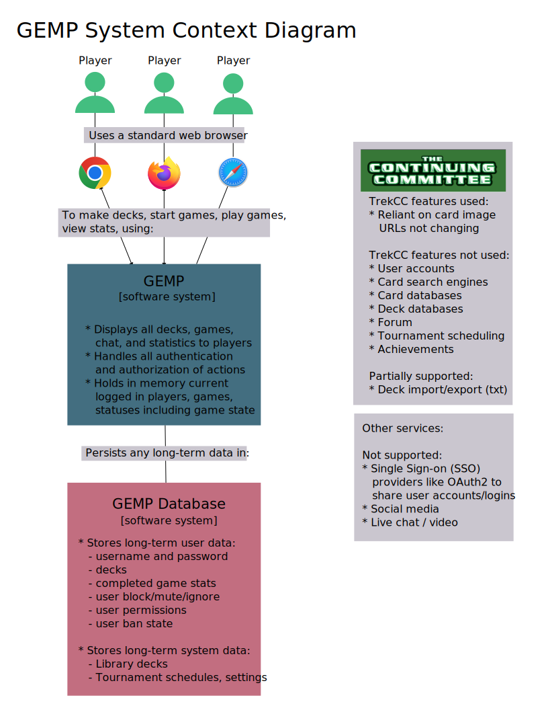
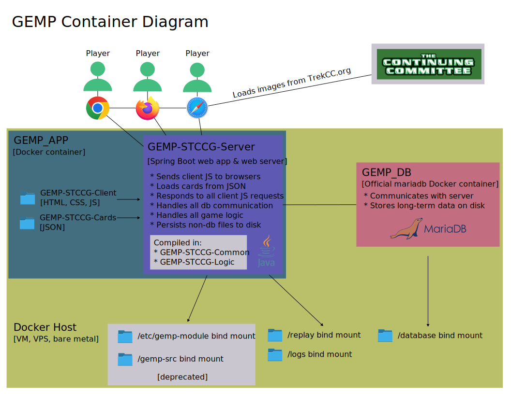
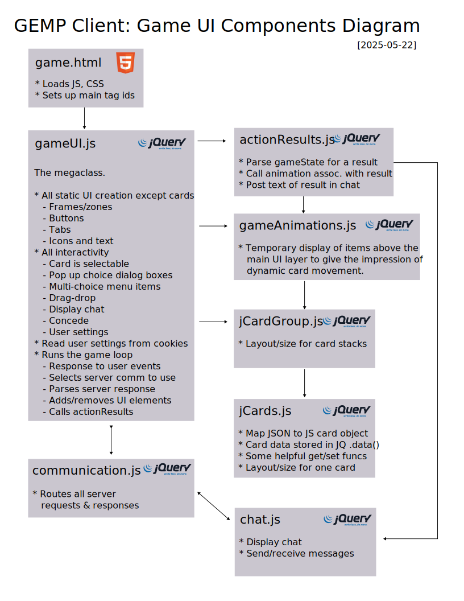

# Architecture
Documented using the [C4 Model](https://c4model.com/)

## Context
Who uses GEMP? Why? How does it relate to other services the user might be familiar with?

## Container
What are the major pieces of a hosted GEMP application? What do those pieces do?

## Component

### GEMP Client

